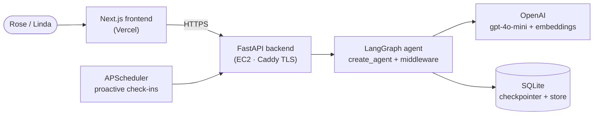

# Vessa

**An AI companion that's always there — a member of an older adult's care team.** A proactive companion for the care receiver, and a calm window for the family caring for them from a distance. Built as an AI-engineering certification capstone / demo-day project.

**Live:** [meetvessa.com](https://meetvessa.com) — [companion](https://meetvessa.com/companion) · [care team](https://meetvessa.com/care-team) · [proof](https://meetvessa.com/proof) · [about](https://meetvessa.com/about)

---

## What this is

Three capabilities, deliberately kept to a tight scope:

- **C1 — Proactive companion that remembers.** A LangGraph agent (`create_agent`) with a caregiver-seeded profile, persistent episodic memory, and a real scheduler that initiates check-ins — not just a reactive chatbot.
- **C2 — Scheduled reminder, closed loop.** A caregiver creates a reminder → the companion surfaces it in conversation → the receiver confirms → the caregiver sees the acknowledgment.
- **C3 — Caregiver visibility.** A "Today" activity feed, reminder management, and a caregiver-notifications log — largely a byproduct of C1/C2's own data.

## Architecture



The interesting part is inside the agent. Every turn runs a composable **middleware pipeline** — `input rails → deterministic side-effects → summarization → dynamic prompt → output rails` — so safety and grounding wrap the model rather than depending on it. Memory is real embedding-based recall (not a transcript dump), the scheduler is an actual background job (not a page-load trigger), and everything runs as plain processes: no Docker, no vector-DB service.

## Safety and provability

A companion for someone with cognitive decline has to prove it's trustworthy, not just claim it — a wrong or ungrounded answer isn't harmless here, and trust lost once may not come back. Three things back that up:

- **Layered guardrails** (`app/guardrails.py`): deterministic regex checks first (fast, free), an LLM-judgment fallback for nuance, and checks on *both* input and output — never medical diagnosis or advice, always redirected to the caregiver or a professional.
- **Deterministic where it's computable** (`app/agent.py`): the time, the day, and whether someone is in the receiver's circle are answered in code, never guessed by the model. A wrong clock reading for someone with memory lapses reinforces disorientation rather than easing it — a fact shouldn't be left to a guess.
- **A real eval suite, not vibes** (`scripts/eval_*.py`): golden-set regression tests for guardrail safety/tone, grounding (time/date accuracy, not inventing unknown people), and memory-recall quality — every case traces back to a real bug found in live testing. Results are visible live at `/proof`, not buried in a terminal or LangSmith. Current: **safety 10/10 · grounding 6/6 · memory 4/4**.

## Stack

| Component | Choice |
|-----------|--------|
| LLM | gpt-4o-mini |
| Orchestration | LangGraph (`create_agent`) + composable middleware (guardrails, grounding, prompting) |
| Memory | Embedding-based episodic recall (OpenAI embeddings + LangGraph store) |
| Persistence | SQLite (checkpointer + store) — survives restarts |
| Scheduler | APScheduler (in-process, proactive check-ins) |
| Backend | FastAPI, plain `uvicorn` — no Docker |
| Frontend | Next.js + Tailwind, deployed on Vercel |
| Deploy | EC2 (Caddy for TLS) — see [`DEPLOY.md`](DEPLOY.md) |

## Project layout

```
app/               # Agent, guardrails, memory, reminders, scheduler, FastAPI routes
scripts/           # Eval suites (safety/grounding/memory), demo seed, deploy helper
provision-vessa/   # Terraform — Vessa's own isolated EC2/VPC
frontend/          # Next.js UI — companion chat + caregiver views + /proof
data/              # SQLite db + cached eval results (gitignored)
```

## Quick start

```bash
uv sync
cp .env.example .env    # set OPENAI_API_KEY
uv run uvicorn app.main:app --reload --port 8010
```

Frontend:
```bash
cd frontend && npm install && cp .env.local.example .env.local && npm run dev
```

Run the evals:
```bash
uv run python scripts/eval_safety.py
uv run python scripts/eval_grounding.py
uv run python scripts/eval_memory.py
```

Deployment: see [`DEPLOY.md`](DEPLOY.md).
